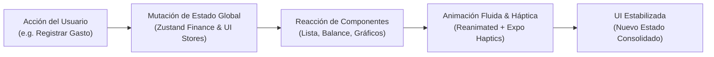

# Sistema Global de Movimiento, Animaciones y Microinteracciones (Finanzas-AI)

Este documento detalla la arquitectura, principios de diseño, tokens de animación, catálogo de componentes y hooks reutilizables implementados para brindar una experiencia de usuario fluida, viva y premium al estilo de las aplicaciones fintech modernas más avanzadas.

---

## 1. Principio Fundamental: Estado → UI → Animación

En Finanzas-AI toda animación responde a un **evento del mundo real o cambio de estado global**:



### Flujo de Registro de un Movimiento (Ingreso o Gasto):
1. **Acción**: El usuario presiona "Guardar" en el BottomSheet.
2. **Microinteracción háptica**: Feedback táctil inmediato (`haptic.success()` o `haptic.medium()`).
3. **Cierre orgánico**: El BottomSheet se desliza hacia abajo mediante resorte físico amortiguado (`SPRING_CONFIG_SMOOTH`).
4. **Auto-Scroll al Hero Card**: El Dashboard detecta el evento mediante `lastRegisteredTx` en `useUIStore` y ejecuta un auto-desplazamiento suave hacia la parte superior (`y: 0`), garantizando que la tarjeta naranja del balance permanezca siempre 100% visible.
5. **Badge Flotante de Dinero**: Se despliega el componente `MoneyArrivalBadge` con halo radiante y rebote suave indicando el importe ingresado/gastado.
6. **Interpolación Numérica de Balance**: El balance anterior transiciona suavemente hacia el nuevo valor mediante `AnimatedNumber` y curva cúbica de deceleración (`400-600ms`), sin saltos bruscos.
7. **Entrada de Transacción con Reordenamiento**: La nueva transacción entra al inicio de la lista con `FadeInDown` y `springify()`. Las transacciones existentes se reacomodan en el espacio vertical con `LinearTransition.springify().damping(18)`.
8. **Toast de Confirmación**: Se muestra una notificación flotante de éxito no invasiva en el `GlobalToastContainer`.

---

## 2. Motion Tokens Centralizados (`src/animations/transitions.ts`)

Todas las duraciones, curvas de aceleración y configuraciones físicas están centralizadas para evitar números mágicos arbitrarios.

### Duraciones (`MOTION_DURATION`)
| Token | Valor | Uso Recomendado |
|---|---|---|
| `fast` | 180ms | Microinteracciones, switches, chips, iconos, scale de botones |
| `normal` | 280ms | Transiciones de tarjetas, tabs, apariciones modales |
| `smooth` | 380ms | Bottom sheets, filtros, desplazamientos de paneles |
| `emphasis` | 520ms | Interpolación numérica de balances, celebraciones |

### Curvas de Easing (`MOTION_EASING`)
- `standard`: `Easing.bezier(0.25, 0.1, 0.25, 1)` - Suave y orgánico.
- `decelerate`: `Easing.out(Easing.cubic)` - Ideal para números y entradas a pantalla.
- `accelerate`: `Easing.in(Easing.cubic)` - Ideal para salidas de pantalla.
- `emphasized`: `Easing.bezier(0.05, 0.7, 0.1, 1)` - Retención y acomodo elegante.

### Configuraciones de Resorte (`Spring Configurations`)
- **`SPRING_CONFIG_SNAPPY`** (`damping: 15, stiffness: 220, mass: 0.8`):
  Utilizado para el feedback al presionar botones (`PressableScale`), chips y pestañas.
- **`SPRING_CONFIG_SMOOTH`** (`damping: 20, stiffness: 140, mass: 1`):
  Utilizado para modales, bottom sheets y cards principales.
- **`SPRING_CONFIG_BOUNCY`** (`damping: 12, stiffness: 160, mass: 0.9`):
  Utilizado para el `MoneyArrivalBadge` y celebraciones visuales.
- **`SPRING_CONFIG_GENTLE`** (`damping: 24, stiffness: 100, mass: 1.2`):
  Utilizado para reordenamientos de listas y layouts flotantes.

### Sistema de Cascada / Stagger (`STAGGER`)
- Intervalo por elemento: 35ms.
- Retardo máximo acumulado: 350ms (evita esperas prolongadas en listas extensas).
- Función auxiliar: `getStaggerDelay(index)`.

### Accesibilidad: Reducción de Movimiento (`Reduce Motion`)
El sistema detecta automáticamente la configuración del sistema operativo (`AccessibilityInfo.isReduceMotionEnabled`):
- `isReduceMotion()` / `useReducedMotion()`
- En caso de estar activado, las transformaciones de escala y traslaciones se reemplazan por un sutil desvanecimiento (`FadeIn.duration(150)`).

---

## 3. Catálogo de Componentes de Movimiento (`src/components/animated/`)

### 1. `PressableScale`
Reemplazo directo de `Pressable` que añade una respuesta táctil elástica natural y háptica integrada al pulsar cualquier botón o elemento interactivo.
- **Props**:
  - `activeScale` / `scaleTo`: factor de contracción (por defecto `0.96`).
  - `hapticType` / `hapticFeedback`: `'light' | 'medium' | 'heavy' | 'selection' | 'warning' | 'success' | 'none'`.
- **Ejemplo**:
```tsx
<PressableScale
  activeScale={0.96}
  hapticType="medium"
  onPress={handleSave}
  style={styles.saveButton}
>
  <Text style={styles.text}>Guardar</Text>
</PressableScale>
```

### 2. `AnimatedNumber`
Componente esencial para cifras financieras (Balance, Ingresos, Gastos, Presupuestos, Ahorros). Interpola números suavemente en lugar de cambiar de golpe.
- **Props**:
  - `value`: número destino actual.
  - `formatter`: función opcional para dar formato a la cifra interpolada (e.g. `(v) => formatCurrency(v, 'DOP')`).
  - `duration`: duración de la transición (por defecto `500ms`).
  - `style`: estilos de texto.
- **Ejemplo**:
```tsx
<AnimatedNumber
  value={availableBalance}
  formatter={(val) => formatCurrency(val, currency, isPrivacyHidden)}
  style={styles.balanceText}
  duration={550}
/>
```

### 3. `MotionView`
Contenedor universal para entradas escalonadas, transiciones de layout y animaciones de entrada/salida.
- **Presets**: `'fade' | 'slideUp' | 'slideDown' | 'slideRight' | 'scale'`.
- **Props**:
  - `index`: índice para aplicar delay stagger automático.
  - `preset`: preset de entrada y salida.
  - `enableLayoutTransition`: activa `LinearTransition` con resorte para reordenamiento automático.
- **Ejemplo**:
```tsx
<MotionView preset="slideUp" index={2}>
  <CardContent />
</MotionView>
```

### 4. `AnimatedCard`
Tarjeta inteligente con animación de entrada, física de pulsación opcional y soporte para reactividad de estado.
- **Props**:
  - `delay`: retardo de entrada.
  - `pressable`: activa efecto de escala al tocar.
  - `onPress`: callback al presionar.
- **Ejemplo**:
```tsx
<AnimatedCard delay={120} pressable onPress={() => openBudgetDetail(budget)}>
  <BudgetInfo />
</AnimatedCard>
```

### 5. `AnimatedProgressBar`
Barra de progreso animada para presupuestos, límites de gastos y metas de ahorro con transición fluida de ancho y color interactivo.
- **Props**:
  - `percentage`: valor de 0 a 100 (se anima suavemente al cambiar).
  - `fillColor`, `trackColor`, `height`, `borderRadius`.
- **Ejemplo**:
```tsx
<AnimatedProgressBar
  percentage={spentPercentage}
  fillColor={isOver ? colors.expense : colors.primary}
  height={8}
/>
```

### 6. `SwipeableTransactionItem`
Fila de transacción enriquecida con gesto nativo Pan (`GestureDetector`) que permite deslizar hacia la izquierda para revelar la acción de eliminar con resistencia elástica, feedback háptico táctil y desaparición con colapso de espacio vertical.
- **Props**:
  - `transaction`: objeto de transacción.
  - `category`: categoría asociada.
  - `onPress`: callback al presionar.
  - `onDelete`: callback para eliminar el movimiento.

### 7. `AnimatedTransaction`
Elemento de lista con animación de entrada escalonada y `LinearTransition.springify().damping(18)` para que al eliminar o insertar elementos, el resto de la lista fluya elásticamente a su nueva posición sin saltos abruptos.

### 8. `ModernSearchBar`
Barra de búsqueda con estética Obsidian Glass y halo radiante Amber Glow interactivo:
- Al recibir foco: se expande ligeramente con resorte físico, despliega un halo cálido (#FF6B00), rota el icono de búsqueda y hace emerger el botón dinámico "Listo".
- Al perder foco o pulsar "Listo": se repliega suavemente a su estado de reposo.

### 9. `MoneyArrivalBadge`
Insignia flotante de celebración para depósitos o egresos con halo exterior pulsante y rebote suave. Aparece temporalmente en el Hero Card del Dashboard y se desvanece automáticamente tras 3.2 segundos.

### 10. `AnimatedTab`
Pestañas interactivas con cápsula indicadora deslizante con resorte `withSpring` que viaja suavemente entre opciones sin redibujos bruscos.

### 11. `AppBottomSheet`
Panel inferior con arrastre gestual (`GestureDetector` + Pan), amortiguación física y descarte al deslizar hacia abajo con umbral de velocidad y distancia.

### 12. `GlobalToastContainer`
Contenedor superior para avisos y confirmaciones de estado con entrada `FadeInUp` amortiguada, barra de progreso o dismiss háptico táctil.

---

## 4. Hooks Reutilizables (`src/hooks/`)

| Hook | Descripción |
|---|---|
| `useAnimatedNumber(value, { duration, formatter, easing })` | Maneja la interpolación numérica continua para textos y cifras financieras. |
| `useScalePress({ scaleTo, hapticType })` | Proporciona `scale`, `handlePressIn`, `handlePressOut` para componentes que requieran física táctil personalizada. |
| `useStagger(index, baseInterval, maxDelay)` | Calcula el retardo ideal para animar listas de elementos de manera armónica. |
| `useReducedMotion()` | Hook reactivo que retorna un booleano indicando si el usuario tiene activada la reducción de movimiento en la configuración del dispositivo. |

---

## 5. Reglas de Oro para Desarrollos Futuros

1. **Nunca usar cambios instantáneos en métricas monetarias**:
   Siempre envolver las cifras financieras relevantes en `AnimatedNumber`.
2. **Evitar animar todo simultáneamente**:
   Utilizar `stagger` moderado (30-40ms) y limitar la animación a los elementos en el viewport inicial.
3. **Todo botón debe ofrecer retroalimentación**:
   Usar `PressableScale` en lugar del `Pressable` plano de React Native.
4. **Respetar la paleta de colores y física central**:
   Utilizar los tokens de `src/animations/transitions.ts` y las variables de tema de `src/constants/theme.ts`.
5. **Preservar el auto-scroll sincronizado**:
   Al crear nuevas transacciones o transferencias, llamar a `triggerRegisteredTxEffect` en `useUIStore` para asegurar que el Dashboard muestre la animación y el balance al usuario sin requerir interacción manual.
